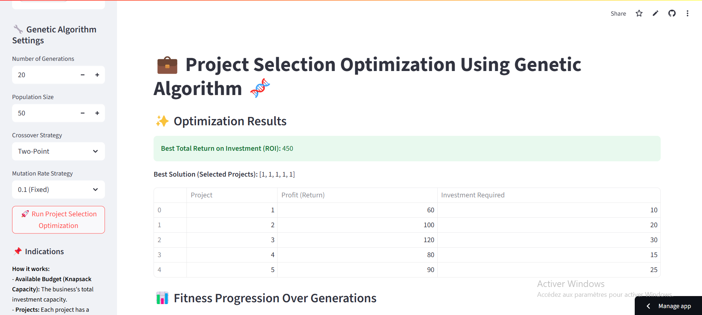

# 🧬 Project Selection using Genetic Algorithms (0-1 Knapsack)

> A Streamlit-powered web app that applies Genetic Algorithms to solve the 0-1 Knapsack problem. Users can optimize project selection under budget constraints to maximize return on investment.

## 🚀 Try the Application

This project is available online!  
You can access the Streamlit interface and test the genetic algorithm parameters here:

👉 [Click here to try the app](https://genetic-knapsack-optimizer-tesqwmxo3s7vrj3hhh7kxe.streamlit.app/)

## 📸 Screenshot

<p align="center">
  
</p>


## 🎯 Problem Statement

In many real-world scenarios like project funding or resource allocation, decision-makers must choose the best subset of items (projects) under a budget. This is modeled as a **0-1 Knapsack problem**, where each item has a profit and weight, and the objective is to **maximize total profit** without exceeding capacity.

This app allows you to:
- Upload your own dataset.
- Tune the **genetic algorithm parameters** (population size, crossover, mutation strategy).
- Visualize performance metrics across generations.


## 🧠 Algorithms Used

The solution leverages the following:
- **Genetic Algorithm (GA)**: Selection, crossover, mutation.
- **Mutation strategies**: Fixed rate, relaxation, Lagrangian method.
- **Crossover types**: Single-point, two-point, uniform.
- **Elitism**: Best individuals preserved in new generations.

## 🧪 Tech Stack

- Python 3.10+
- Streamlit
- Pandas
- Matplotlib

## ⚙️ How to Run

### 1. Clone the repo
```bash
git clone https://github.com/<username>/genetic-knapsack-optimizer.git
cd genetic-knapsack-optimizer
```

### 2. Install dependencies
```bash
pip install -r requirements.txt
```

### 3. Run the Streamlit app
```bash
streamlit run src/app.py
```

## 📁 Example CSV format
```csv
Profit,Weight
60,10
100,20
120,30
80,15
90,25
```

## 📊 Sample Results

| Crossover     | Mutation     | Max Fitness |
|---------------|--------------|-------------|
| Single-Point  | 0.1 Fixed    | 73500       |
| Two-Point     | Lagrangian   | 73700       |
| Uniform       | Relaxation   | 73500       |

## 📄 Report

Find the full academic write-up in [`0-1Knapsack report.pdf`](0-1Knapsack report.pdf), which includes:
- Theoretical explanation of the KP01 problem.
- Description of algorithms.
- Comparative experiments.
- Interface screenshots.

> 💡 **Note:** While this project is presented in the context of project selection, it can easily be adapted to other constraint-based optimization problems, such as:
>
> - Time management (e.g., choosing the most profitable tasks within limited hours)
> - Resource allocation (budget, people, materials…)
> - Task scheduling, or any "knapsack-type" decision-making scenario
> Users can customize the inputs (profits, weights, budget) based on their specific context.


